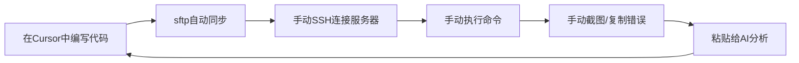

# 让Cursor AI直接操控远程服务器：cursor-bridge实战指南

> 从手动SSH到AI语音操控远程服务器的完美进化

## 📋 知识点概览

**主题标签**: #AI开发工具 #Cursor #远程服务器 #MCP协议 #tmux #开发效率

**难度等级**: 中级-高级

**适用场景**: 
- 企业内网环境下的远程开发
- 多服务器管理和切换
- AI辅助的自动化运维
- 深度学习模型训练管理

**核心价值**: 实现AI与远程服务器的无缝交互，从断裂式工作流升级为AI驱动的闭环自动化

---

## 🎯 问题背景

### 企业开发中的痛点

在企业内网环境下，开发者经常面临"被安全策略割裂的工作流"：



**核心问题**:
1. **AI感知断裂**: Cursor无法直接"看到"远程环境状态
2. **操作断裂**: 每次都需要人工充当"中介"
3. **上下文丢失**: AI无法保持对远程环境的持续认知
4. **效率低下**: 简单的编译、运行、调试都需要多次手动转换

### 理想的AI闭环工作流

```
你: "请在HG223服务器上编译并运行我的新代码"
AI: "好的，我来处理"
    [自动执行] cd /workspace/my-project
    [自动执行] make clean && make
    [自动分析] 编译成功，开始运行...
    [自动执行] python train.py --config config.yaml
    [实时监控] Epoch 1/100, Loss: 0.234, GPU使用率: 85%
    [智能建议] "训练正常启动，预计需要2小时完成"
```

---

## 💡 解决方案：cursor-bridge

### 核心设计理念

cursor-bridge采用"连接复用+AI代理"的架构：

```
自然语言指令 → Cursor AI → cursor-bridge → tmux会话 → 远程服务器
                                     ↑
                                一次连接，持续复用
```

### 技术架构


### 关键优势

- 🔄 **连接复用**: 基于tmux会话，一次连接持续使用
- 🤖 **AI代理**: 通过MCP协议让AI直接执行远程命令
- 🛡️ **安全可靠**: 复用现有的安全连接，不改变企业网络架构
- ⚡ **零延迟**: 本地tmux会话，毫秒级响应

---

## 🚀 快速上手

### 部署方案选择

cursor-bridge提供两种部署方式，满足不同需求：

#### 方案一：NPM包方式（推荐）- 零配置部署

**适用场景**: 希望快速上手，减少配置复杂度

```json
// 在 ~/.cursor/mcp.json 中添加一行配置
{
  "mcpServers": {
    "cursor-bridge": {
      "command": "npx", 
      "args": ["-y", "@xuyehua/cursor-bridge-mcp"]
    }
  }
}
```

**优势**:
- ✅ 无需手动安装Python依赖
- ✅ 自动环境检测和配置
- ✅ 跨平台一致体验
- ✅ 自动版本更新

#### 方案二：源码方式 - 完全控制

**适用场景**: 需要自定义修改或深度定制

```bash
# 克隆项目并安装
git clone https://github.com/maricoxu/cursor-bridge.git
cd cursor-bridge
./install.sh
```

**配置MCP服务器**:
```json
{
  "mcpServers": {
    "cursor-bridge": {
      "command": "python3",
      "args": ["/path/to/cursor-bridge/src/cursor_bridge/mcp_server_lightweight.py"],
      "env": {"PYTHONPATH": "/path/to/cursor-bridge/src"}
    }
  }
}
```

### 服务器连接配置

无论选择哪种部署方式，都支持配置文件驱动的服务器管理：

```yaml
# servers_config.yaml - 服务器连接配置文件
servers:
  # 服务器1：深度学习训练服务器（直连）
  dl-server-01:
    host: "192.168.1.100"              # 服务器IP或主机名
    username: "zhangsan"               # 你的用户名
    session_name: "dl-server-01"       # tmux会话名称（建议与服务器名一致）
    workspace_dir: "/home/zhangsan/workspace"  # 工作目录
    vpn_command: "pulse-secure-vpn connect"    # VPN连接命令（如果需要）
    gpu_count: 4                       # GPU数量（用于资源监控）
    gpu_type: "Tesla V100"             # GPU型号（可选）
    description: "主要训练服务器"       # 服务器描述
    
  # 服务器2：企业内网服务器（通过跳板机）  
  cpu-cluster-01:
    host: "cpu-cluster.company.com"    # 目标服务器地址
    username: "zhangsan"               # 目标服务器用户名
    session_name: "cpu-cluster-01"     
    workspace_dir: "/data/projects"    # 工作目录
    vpn_command: ""                    # 如果不需要VPN，留空
    gpu_count: 0                       # CPU服务器无GPU
    description: "CPU计算集群"
    
    # 二级跳配置（跳板机）
    jump_host:
      host: "jumpserver.company.com"   # 跳板机地址
      username: "zhangsan"             # 跳板机用户名
      port: 22                         # 跳板机SSH端口
      ssh_key_path: "~/.ssh/jump_key"  # 跳板机专用密钥（可选）
    
  # 服务器3：高安全环境服务器（双跳）
  secure-server:
    host: "10.0.1.100"                 # 最终目标服务器
    username: "zhangsan"               
    session_name: "secure-server"
    workspace_dir: "/home/zhangsan/secure-workspace"
    gpu_count: 8
    gpu_type: "A100"
    description: "高安全计算环境"
    
    # 双跳配置示例
    jump_host:
      host: "bastion.company.com"      # 第一级跳板机
      username: "zhangsan"
      port: 22
      
      # 第二级跳板机（可选）
      second_jump:
        host: "internal-jump.company.com"
        username: "zhangsan"
        port: 22
    
  # 服务器4：开发测试服务器（简单配置）
  dev-server:
    host: "dev.internal.company.com"   
    username: "zhangsan"               
    session_name: "dev"
    workspace_dir: "/home/zhangsan/dev"
    vpn_command: "sudo openvpn --config company.ovpn"
    gpu_count: 2
    gpu_type: "RTX 3090"
    description: "开发测试环境"

# 全局设置
global_settings:
  default_server: "dl-server-01"       # 默认连接的服务器
  connection_timeout: 30               # 连接超时时间（秒）
  ssh_key_path: "~/.ssh/id_rsa"       # 默认SSH密钥路径
  auto_reconnect: true                 # 断线自动重连
  
  # SSH连接选项
  ssh_options:
    ServerAliveInterval: 60            # 保活间隔
    ServerAliveCountMax: 3             # 最大保活次数
    StrictHostKeyChecking: "no"        # 跳过主机密钥检查（仅开发环境）
```

**配置说明**：
- `host`: 替换为你的服务器IP或主机名
- `username`: 替换为你在服务器上的用户名
- `workspace_dir`: 替换为你的实际工作目录
- `vpn_command`: 根据你的VPN软件填写，不需要VPN就留空
- `jump_host`: 跳板机配置，支持单跳和双跳
- `ssh_options`: SSH连接优化参数

### 验证安装

```bash
# 对于NPM方式，重启Cursor即可自动验证
# 对于源码方式，可以手动验证
./start_cursor_bridge.sh
./verify_setup.sh
```

---

## 🎮 实际使用示例

### 基础操作

#### 1. 服务器状态检查

```
用户: "请检查一下dl-server-01的GPU使用情况"

AI: 我来帮你检查dl-server-01的GPU状态
    [执行命令] nvidia-smi
    [分析结果] GPU状态正常，当前使用率12%，显存使用2GB/16GB，温度32°C
```

#### 2. 智能编译调试

```
用户: "请帮我在dl-server-01上编译并运行我刚修改的C++代码"

AI: 我来帮你执行完整的编译运行流程
    [执行] cd /home/zhangsan/workspace/cpp-project && make clean && make
    [发现错误] main.cpp:25:18: error: 'std::vector' has no member named 'push'
    [自动修复] sed -i 's/\.push(/\.push_back(/g' main.cpp
    [重新编译] make 
    [执行程序] ./main
    [结果] ✅ 代码修复并运行成功！
```

### 高级应用场景

#### 1. AI驱动的模型训练

```
用户: "请在dl-server-01上训练图像分类模型，如果遇到问题帮我自动解决"

AI: 我来为你执行完整的模型训练流程
    [启动训练] python train.py --config config/resnet50.yaml
    [遇到问题] CUDA out of memory. Tried to allocate 2.00 GiB
    [自动优化] 将batch_size从64调整为32
    [重新启动] 训练正常进行中，当前准确率28.7%
```

#### 2. 智能资源调度

```
用户: "我有一个大型训练任务，请帮我找到最合适的服务器"

AI: 我来为你进行智能资源调度
    [扫描dl-server-01] GPU: 4x V100, 使用率: [12%, 15%, 89%, 91%]
    [扫描cpu-cluster-01] CPU: 64核, 使用率: 45%, 内存: 60%
    [扫描dev-server] GPU: 2x RTX3090, 使用率: [5%, 8%]
    [智能分析] dl-server-01有2个V100可用，适合大型训练
    [推荐方案] 使用dl-server-01的GPU 0,1，预计训练时间6小时
```

#### 3. 多服务器协同工作

```
用户: "帮我在测试服务器上验证模型，然后部署到生产环境"

AI: 我来执行多服务器协同部署流程
    [连接test-server] 正在测试环境验证模型...
    [执行测试] python test_model.py --model checkpoint.pth
    [测试结果] ✅ 准确率95.2%，满足部署标准
    [切换到prod-server] 开始生产环境部署...
    [部署模型] 模型已成功部署到生产环境
    [健康检查] 服务启动正常，API响应时间200ms
```

---

## 🔧 故障排除

### 常见问题解决

| 问题 | 症状 | 解决方案 |
|------|------|----------|
| tmux会话丢失 | 找不到远程会话 | `tmux list-sessions` 检查并重建 |
| MCP连接失败 | Cursor无法调用工具 | 检查 `~/.cursor/mcp.json` 配置 |
| 命令执行超时 | 长时间无响应 | 调整 `cursor_bridge_config.yaml` 中的timeout |
| NPM包安装失败 | 网络或权限问题 | 检查网络连接，使用 `--registry` 指定镜像源 |

### 调试模式

```bash
# NPM方式调试
npx @xuyehua/cursor-bridge-mcp --debug

# 源码方式调试
export CURSOR_BRIDGE_DEBUG=1
./start_cursor_bridge.sh

# 实时查看调试信息
tail -f cursor_bridge.log | grep DEBUG
```

---

## 🌟 最佳实践

### 1. 工作流建议

1. **晨间启动**: 每天开始工作时运行连接脚本
2. **项目切换**: 使用不同tmux会话管理不同项目
3. **状态监控**: 定期让AI检查服务器资源使用情况
4. **自动备份**: 训练任务配置自动checkpoints

### 2. 安全建议

- 使用SSH密钥认证而非密码
- 定期更新cursor-bridge到最新版本
- 限制MCP工具的执行权限
- 开启操作日志记录

### 3. 效率提升技巧

- 建立常用命令的快捷方式
- 使用配置文件管理多套环境
- 结合Cursor的语音输入功能
- 设置智能告警和监控

### 4. 多服务器管理

```bash
# 批量连接服务器
./scripts/connect_with_config.py --config servers_config.yaml --all

# 查看所有服务器状态
./scripts/connect_with_config.py --config servers_config.yaml --list

# 智能服务器选择
你: "帮我选择最适合跑深度学习的服务器"
AI: "正在扫描可用GPU资源..."
    [分析结果] 推荐使用dl-server-01，有2个空闲V100
```

---

## 📈 技术细节与扩展

### MCP协议集成

cursor-bridge实现了完整的MCP（Model Context Protocol）规范：

```python
# 核心工具注册
tools = [
    {
        "name": "execute_command",
        "description": "在远程服务器上执行命令",
        "inputSchema": {
            "type": "object",
            "properties": {
                "command": {"type": "string"},
                "server": {"type": "string"},
                "working_directory": {"type": "string"}
            }
        }
    },
    {
        "name": "check_server_status", 
        "description": "检查服务器状态和资源使用情况",
        "inputSchema": {
            "type": "object",
            "properties": {
                "server": {"type": "string"},
                "check_type": {"type": "string", "enum": ["cpu", "gpu", "memory", "disk"]}
            }
        }
    }
]
```

### tmux会话管理策略

```bash
# 会话创建策略
tmux new-session -d -s "server-name" "ssh user@server"

# 会话复用检查
if tmux has-session -t "server-name" 2>/dev/null; then
    echo "复用现有会话"
else 
    echo "创建新会话"
fi

# 智能重连机制
tmux send-keys -t "server-name" "if ! pgrep -f 'ssh.*server'; then ssh user@server; fi" Enter
```

### 发展路线图

#### 当前阶段：核心功能 ✅
- MCP服务器基础架构
- tmux会话管理
- 基本命令执行功能
- NPM包标准化部署

#### 近期规划：工具增强 🚧
- 配置文件驱动的连接管理
- 服务器状态检查工具
- 训练任务监控脚本
- GPU使用率实时监控

#### 长期愿景：智能化 🔮
- AI驱动的资源调度
- 智能错误诊断和自动修复
- 预测性维护和告警系统
- 多项目协同管理

---

## 💬 社区与支持

**项目地址**: https://github.com/maricoxu/cursor-bridge

**NPM包**: `@xuyehua/cursor-bridge-mcp`

**交流方式**:
- GitHub Issues: 报告问题和功能建议
- 技术讨论: 欢迎PR和技术交流
- 使用案例: 分享你的使用经验

**贡献方向**:
1. 提交使用场景和需求
2. 开发新的工具脚本
3. 完善文档和教程
4. 测试和问题反馈

---

## 🎯 总结要点

cursor-bridge项目实现了从"手动SSH操作"到"AI语音操控远程服务器"的革命性进步：

**🔄 连接复用**: 基于tmux会话，一次连接持续使用
**🤖 AI代理**: 通过MCP协议实现AI与远程服务器的无缝交互  
**🛡️ 安全可靠**: 复用现有企业安全架构
**⚡ 高效便捷**: 自然语言指令，毫秒级响应
**📦 部署简化**: NPM包方式让安装部署变得极其简单

这不仅仅是一个工具，更是开发工作方式的革命。让AI成为你的远程服务器操作助手，专注于创造价值而非重复操作。

**立即尝试cursor-bridge，体验AI驱动的远程开发新时代！**

---

*本文档持续更新中，如有问题或建议，欢迎通过GitHub Issues反馈。* 