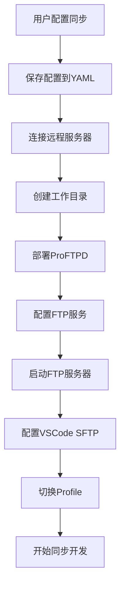

# 🔄 自动化同步功能使用指南

## 📋 功能概述

自动化同步功能让您可以在本地VSCode中直接编辑远程服务器上的文件，实现无缝的开发体验。该功能通过以下组件实现：

- **ProFTPD服务器**: 在远程服务器上自动部署FTP服务
- **VSCode SFTP插件**: 自动配置本地VSCode的SFTP连接
- **智能文件同步**: 支持实时上传和双向同步

## 🚀 快速开始

### 1. 启用同步功能

在配置服务器时，选择启用同步功能：

```bash
# 运行配置向导
python3 enhanced_config_manager.py

# 选择 "1. 向导配置"
# 在同步功能配置环节选择 "y" 启用
```

### 2. 配置参数

系统会询问以下配置参数：

- **远程工作目录**: 默认 `/home/Code`，可自定义
- **本地工作目录**: 默认当前目录，可自定义  
- **FTP端口**: 默认 `8021`
- **FTP用户名**: 默认 `ftpuser`
- **FTP密码**: 自定义密码

### 3. 连接服务器

启用同步功能后，连接服务器时会自动：

```bash
# 使用MCP工具连接
npx @xuyehua/remote-terminal-mcp connect <server-name>
```

连接过程中会自动：
1. 创建远程工作目录
2. 部署ProFTPD服务器
3. 配置并启动FTP服务
4. 配置本地VSCode SFTP插件

## 📁 配置文件结构

### 服务器配置示例

```yaml
servers:
  my-dev-server:
    host: dev-server.com
    user: developer
    type: ssh
    # 同步功能配置
    sync:
      enabled: true
      remote_workspace: "/home/Code"
      local_workspace: "/Users/username/Projects"
      ftp_port: 8021
      ftp_user: "ftpuser"
      ftp_password: "your_secure_password"
```

### VSCode SFTP配置

系统会自动在 `.vscode/sftp.json` 中创建配置：

```json
{
  "profiles": {
    "remote-terminal-my-dev-server": {
      "name": "远程终端-my-dev-server",
      "protocol": "ftp",
      "host": "localhost",
      "port": 8021,
      "username": "ftpuser",
      "password": "your_secure_password",
      "remotePath": "/home/Code",
      "uploadOnSave": true,
      "passive": true,
      "ignore": [
        ".vscode",
        ".git",
        ".DS_Store",
        "node_modules/**",
        "*.log"
      ]
    }
  },
  "defaultProfile": "remote-terminal-my-dev-server"
}
```

## 🔧 使用方法

### 在VSCode中使用

1. **自动切换Profile**: 连接成功后，系统会尝试自动切换到对应的SFTP profile

2. **手动切换Profile**: 
   - 按 `Ctrl+Shift+P` (Windows/Linux) 或 `Cmd+Shift+P` (Mac)
   - 输入 `SFTP: Set Profile`
   - 选择 `remote-terminal-<server-name>`

3. **文件同步操作**:
   - **上传文件**: 保存文件时自动上传 (uploadOnSave: true)
   - **下载文件**: `SFTP: Download Folder` 或 `SFTP: Sync Remote -> Local`
   - **同步文件夹**: `SFTP: Sync Local -> Remote`

### 命令行操作

```bash
# 检查FTP服务状态
netstat -tlnp | grep 8021

# 查看ProFTPD日志
cat var/proftpd.system.log

# 重启ProFTPD服务
./proftpd -n -c ./proftpd.conf &
```

## 🛠️ 高级配置

### 自定义FTP端口

如果默认端口8021被占用，可以修改配置：

```yaml
sync:
  enabled: true
  ftp_port: 8022  # 使用其他端口
```

### 多项目工作区

为不同项目配置不同的远程目录：

```yaml
# 项目A
sync:
  remote_workspace: "/home/Code/project-a"
  
# 项目B  
sync:
  remote_workspace: "/home/Code/project-b"
```

### 安全配置

1. **使用强密码**: 设置复杂的FTP密码
2. **限制访问**: ProFTPD配置仅允许本地连接
3. **定期更新**: 定期更换FTP密码

## 🔍 故障排除

### 常见问题

#### 1. FTP连接失败

**症状**: VSCode无法连接到FTP服务器

**解决方案**:
```bash
# 检查FTP服务是否运行
netstat -tlnp | grep 8021

# 检查防火墙设置
sudo ufw status

# 重启ProFTPD服务
cd /path/to/workspace
./proftpd -n -c ./proftpd.conf &
```

#### 2. 文件上传失败

**症状**: 保存文件时无法上传到远程服务器

**解决方案**:
1. 检查远程目录权限
2. 验证FTP用户权限
3. 检查磁盘空间

#### 3. Profile未自动切换

**症状**: VSCode未自动切换到正确的SFTP profile

**解决方案**:
1. 手动切换: `Ctrl+Shift+P` → `SFTP: Set Profile`
2. 检查 `.vscode/sftp.json` 配置
3. 重启VSCode

### 调试模式

启用详细日志输出：

```bash
# 设置环境变量
export MCP_DEBUG=1

# 连接服务器查看详细日志
npx @xuyehua/remote-terminal-mcp connect <server-name>
```

## 📚 技术架构

### 组件说明

1. **配置管理器** (`enhanced_config_manager.py`)
   - 处理同步配置的交互式设置
   - 验证配置参数
   - 保存配置到YAML文件

2. **VSCode同步管理器** (`vscode_sync_manager.py`)
   - 管理 `.vscode/sftp.json` 配置文件
   - 支持多profile配置
   - 自动切换profile功能

3. **SSH连接管理器** (`enhanced_ssh_manager.py`)
   - 集成同步环境设置
   - 自动部署ProFTPD服务器
   - 配置FTP服务和用户权限

4. **ProFTPD服务器** (`proftpd.tar.gz`)
   - 预编译的FTP服务器
   - 支持用户认证和目录限制
   - 优化的配置文件

### 工作流程



## 🔄 更新和维护

### 更新ProFTPD

如果需要更新ProFTPD版本：

1. 替换 `templates/proftpd.tar.gz`
2. 重新运行 `npm install`
3. 重新连接服务器

### 清理配置

删除同步配置：

```bash
# 删除VSCode配置
rm .vscode/sftp.json

# 删除远程FTP服务
pkill proftpd
rm -rf /path/to/workspace/proftpd*
```

## 🤝 贡献和反馈

如果您遇到问题或有改进建议，请：

1. 查看 [GitHub Issues](https://github.com/maricoxu/remote-terminal-mcp/issues)
2. 提交新的Issue或Pull Request
3. 参与社区讨论

---

**注意**: 该功能目前处于测试阶段，建议在生产环境使用前进行充分测试。 